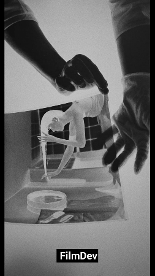
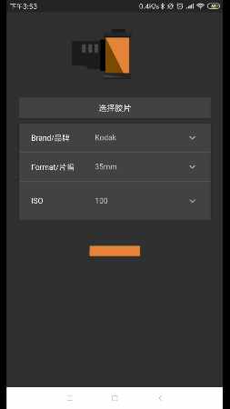
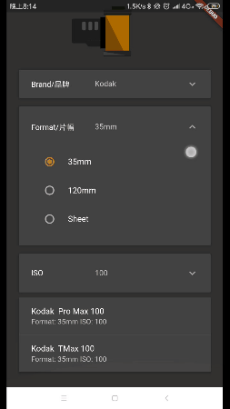
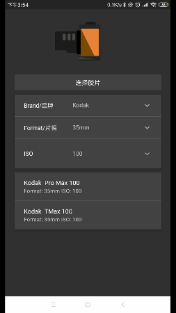
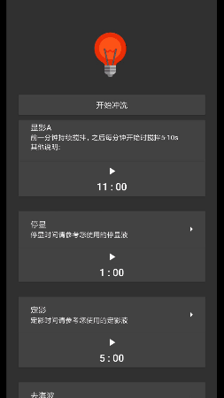
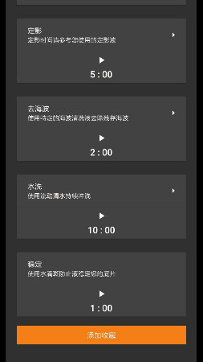

# FilmDev

## 概述
这是一款使用`Flutter`开发的胶片冲洗小工具

采用`Bloc`模式开发，`Bloc`是一种类似`RxJava`的订阅者模式，可以将逻辑代码与UI代码隔离开从而实现更好的解耦.

使用了[2dimension](https://www.2dimensions.com/)的Flare工具制作过场动画

已上架酷安 欢迎下载体验
[FilmDev](https://www.coolapk.com/apk/com.jiangxq.filmdev)







## 迭代日志：
>
###  **1.0.46**
已发布
#### Feature：
* 支持多种型号的底片
* 支持查询迫冲数据
* 支持自定义冲洗时间
* 冲洗计时器支持暗房模式
* 支持收藏夹功能
>
### **1.0.47**
已发布
#### BugFix：
* 修正冲洗计时器暗房模式中弹出Dialog时暗房模式失效
* 暗房模式采用沉浸式设计，隐藏状态栏和导航栏
>
### **1.0.61**
已发布
#### Feature:
* 增加应用内更新，以支持灰度发布 ✅
* 增加分享功能 ✅
* 支持更多底片 ✅
* 药液选择页面优化 ✅
### **1.0.65**
已发布
#### Feature:
* 增加C41 E6标准冲洗程序 ✅


## 项目结构
### `/bloc`
`bloc`组件 
在这里处理业务逻辑，比如查询数据，失败处理 暴露`Sink` 和 `Stream` 属性给其他组件使用
均继承`BlocBase`实现`dispose`接口。

### `/dao`
`dao.dart/DbManager` 数据库操作的辅助类
拷贝数据库文件，提供增删改查接口，使用单例实现

### `/pages`
UI部分 负责创建App的各个页面
### `/providers`
提供BloC组件供其他组件使用

#### 获取
在Widget中,通过

```dart
BlocBase bloc = BlocProvider.of<T>(context);
```
获得相应的`BloC`组件
#### 构建UI

container中：

```dart
home: BlocProvider(
          bloc: T extents BlocBase,
          child: BlocWidget(),
        ),
```

在`child`的`BlocWidget`中，只需要使用`StreamBuilder`来构建对应的UI就好了，而数据的改变UI可做到完全无感知


```dart
BlocWidget：

StreamBuilder<int>(
                stream: bloc.stream,
                initialData: 0,
                builder: (BuildContext context,AsyncSnapshot<int> snapshot){
                  return new Text('${snapshot.data}',style: Theme.of(context).textTheme.display1,);
                },
```
### `/utils`
工具类
### `/widgets`
自定义的一些widget

---

Demo采用的数据均抓取自[www.digitaltruth.com](www.digitaltruth.com) ，几乎囊括了目前在售的所有胶片类型和冲洗套药数据。
**仅限个人交流使用 如有侵权 请联系我删除。**


